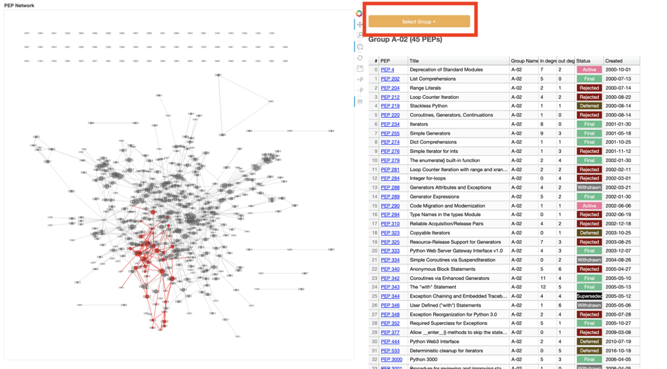

# PEPCluster

https://komo-fr.github.io/PEPCluster/

オレンジの "Select Group" ボタンをクリックすると、クラスタを切り替えられます。

# Slide
[[Python Charity Talks in Japan] ネットワーク解析とテキスト解析で見るPEP](https://speakerdeck.com/komofr/pycharity)

# Data
- [クラスタリングの結果（CSV）](https://github.com/komo-fr/PEPCluster/blob/master/data/clustering_result.csv)
    - `group_category`はクラスタの種類を意味しています。
      - A = 4個以上のPEPで構成されるクラスタ
      - B = 2-3個のPEPで構成されるクラスタ
      - C = 1個のPEPで構成されるクラスタ（どのPEPとも引用関係がないPEP）
- [グラフデータ(gpickle)](https://github.com/komo-fr/PEPCluster/blob/master/data/pep_graph_with_position.gpickle)
- [各クラスタのワードクラウド](https://github.com/komo-fr/PEPCluster/tree/master/wordcloud)
